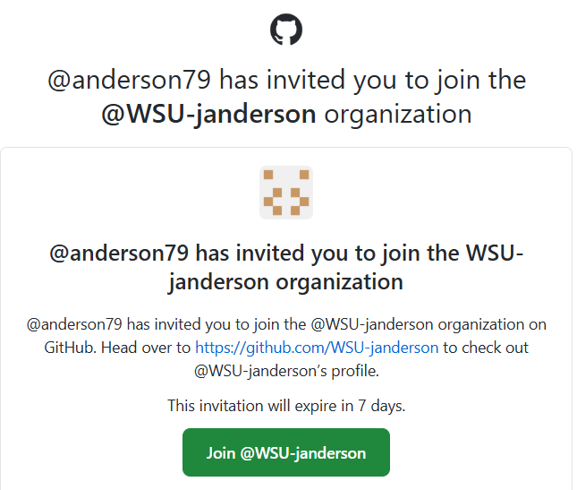
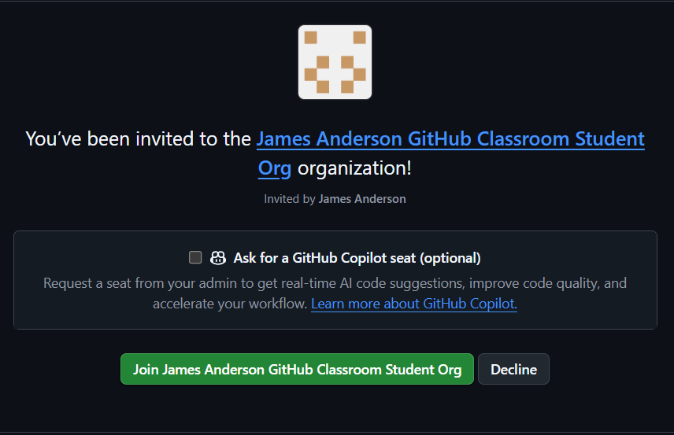
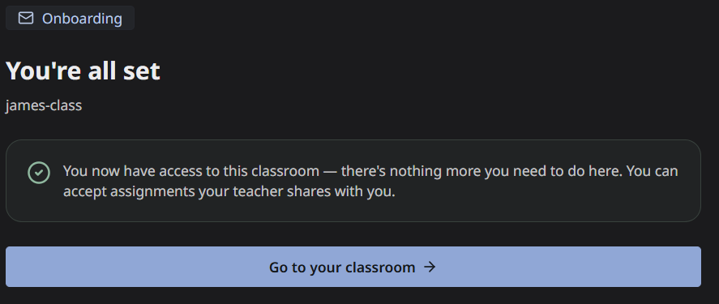
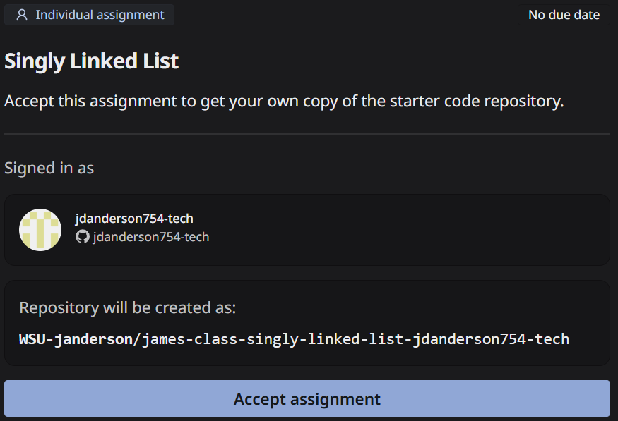
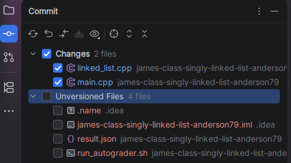
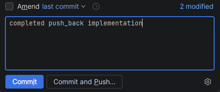
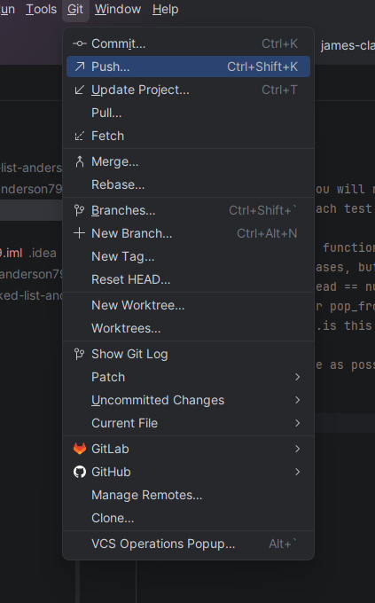

# Classroom 50 – Getting Started

This course uses **Classroom 50** for all programming coursework.

For each assignment, Classroom 50 will create a **private GitHub repository** for you. Only you, the instructor, and the TA have access to this repository. 

You will complete your work locally, commit your changes with `git`, and push those commits to GitHub.

---

## Step 1: Create or Log In to Your GitHub Account

You must have a GitHub account to use Classroom 50.

If you already have an account, log in at:  
[https://github.com](https://github.com)

If not, create one at:  
[https://github.com/signup](https://github.com/signup)

You may use any email as the **primary email address** for your GitHub account, however if it is not the primary email, you still **must add** your WSU email to the account. In addition, you **must verify** your WSU email through GitHub.

To view or add email addresses associated with your GitHub account, go to:  
[https://github.com/settings/emails](https://github.com/settings/emails)

⚠️ **Most setup issues happen because students skip Step 2. Do not skip it.**

## Step 2: Accept Invitation to `WSU-janderson` GitHub Organization

Before joining Classroom 50 for this course, you need to accept an invitation to the `WSU-janderson` GitHub organization. You should receive an email with a subject similar to:

```text
[GitHub] @anderson79 has invited you to join the @WSU-janderson organization
```

The email should look similar to:



A link for Classroom 50 onboarding is on the course's Pilot page.

Click the button in the email to `Join @WSU-janderson`. That will open a webpage that should look similar to:



You can also check any pending GitHub organization invitations at:  
[https://github.com/settings/organizations](https://github.com/settings/organizations)

If you do not accept the invitation:

- Assignment links may fail
- You may receive permission errors
- Your assignment repository may not be created correctly
- You may be unable to clone or push to your repository

## Step 3: Complete Classroom 50 Onboarding

Once you have joined the organization, you then need to join our course's classroom in Classroom 50.

1. Open the onboarding link in Pilot.
2. Sign in to GitHub if or when prompted with your GitHub account linked to your WSU email.
3. Select your WSU email address
4. Follow any instructions to connect your GitHub account to the course.

If those steps were successful, you should see a page that looks similar to:



✅ **You only need to join the GitHub organization and the course Classroom 50 once for the entire semester.**

---

## Step 4: Accept an Assignment

Each assignment will have a unique Classroom 50 link posted in Pilot.

1. Click the assignment link.
1. SIgn in to GitHub if prompted
1. You will be taken to a GitHub Classroom page.
1. Click **Accept Assignment**.

    

1. Wait a few seconds while GitHub creates your repository.

When this finishes, you will see a page with a link to **your private repository**.

That repository is now yours for that assignment.

---

## Step 5: Clone the Repository

After accepting the assignment, clone the repository to your computer.

You can clone it using **CLion** or the command line.

### Option A: Clone Using CLion (Recommended)

1. Copy the URL of your assignment repository from GitHub
1. Open CLion
1. Choose `Get from VCS`
1. Paste the repository URL
1. Choose where the repository should be stored on your computer.
    - I do not recommend cloning your repos into a directory that syncs with a cloud service such as OneDrive or Google Drive.
1. Click `Clone`

CLion should open the project and configure CMake automatically.

---

### Option B: Clone Using the Command Line
```bash
git clone <repository-url>
```

Replace `<repository-url>` with the URL of your assignment repository.

After cloning, open the newly created folder in CLion.

---

## Step 6: Complete the Assignment

Your normal workflow will look like this:

1. Edit your code
1. Build and run the program locally
1. Test your code by running your own or the provided tests
1. Fix any errors
1. Commit your changes
1. Push your commits to GitHub

Do not wait until you have completed the entire assignment before making your first commit. Commit and push regularly so that your work is backed up and your progress is visible.

### Commit Example

```bash
git add .
git commit -m "Completed push_back implementation"
git push
```

You may also use CLion's Git tools instead of the command line. You would first need to add files to the commit via the Commit panel:



You then enter a commit message:



You can choose to `Commit` the changes, or you can `Commit and Push...`. If you choose `Commit`, you later need to `push` either via the command line or from the `Git` menu in CLion's Main Menu.



---

### How Submissions Work

There is no separate **Submit** button in Pilot or Classroom 50.

Your submission is the code that you have committed and pushed to your GitHub assignment repository.

The version used for grading will be determined from the commits pushed to the repository according to the assignment deadline and late-work policy.

**Remember:**

- Saving a file in CLion does not submit it.
- Committing a file does not submit it unless it is also pushed.
- Code that exists only on your computer cannot be graded.
- If you forget to push, your work has not been submitted.

You can verify that your work was pushed by opening the repository on GitHub and checking that your most recent file changes and commit appear there.

---

### Automated Tests

Some assignments may run automated tests whenever you push a commit.

You can view these results on the GitHub repository page under **Actions** or beside the commit status.

A green check mark means the automated workflow completed successfully. A red X means:

- One or more tests failed
- The project did not compile, or
- The automated workflow encountered another error

Passing the visible automated tests does not necessarily guarantee full credit. Your submission may also be checked with additional instructor tests and reviewed for correctness, code quality, and assignment requirements.

---

## Common Problems 

### **“Permission denied” when cloning or pushing**

Possible causes include:

- You did not accept the GitHub organization invitation.
- You are logged into the wrong GitHub account.
- CLion or Git is using credentials for a different GitHub account
- You are trying to clone or push to someone else's repository

Check your GitHub account and organization membership before trying again.

### **Assignment link says you do not have access**

Make sure that:

- You completed Classroom 50 onboarding
- You accepted the GitHub organization invitation
- You are signed into the correct GitHub account
- Your Wright State email address has been added to and verified on that account.

### **I accepted the assignment but don’t see a repository**

Repository creation make take a short time.

1. Wait approximately 30-60 seconds.
1. Refresh the Classroom 50 page.
1. Check the course's GitHub organization
1. Check your GitHub repositories

Do not repeatedly accept the assignment using different GitHub accounts.

### My changes do not appear on GitHub

You may have committed your changes without pushing them.

In CLion, use `Git -> Push`, or run:

```bash
git push
```

Then refresh the repository page on GitHub

### The automated tests did not run

First, confirm that your commit was pushed successfully.

Automated tests generally run only after GitHub receives a new commit. If necessary, make a meaningful correction, commit it, and push again.

Do not make empty or meaningless commits merely to create additional workflow runs.

### CLion opened the project, but CMake did not configure correctly

Try the following:

1. Make sure you opened the assignment's top-level directory.
1. Confirm that the directory contains `CMakeLists.txt`.
1. In CLion, select `Tools -> CMake -> Reload CMake Project`.
1. Read any CMake error messages shown in the `CMake` panel.  
The `CMake` panel is opened by clicking the triangle icon in the lower-left of CLion that says `CMake` when hovered over.

Do not rename, remove, or reorganize starter files unless the assignment explicitly tells you to do so.

---

## Protect Your Repository

Your assignment repository is private.

Do not:

- Add another student as a collaborator.
- Share your repository or code with another student.
- Copy code from another student's repository
- Give another person access to your GitHub account.
- Make the repository public.

You are responsible for work submitted through your GitHub account.

---

## Need Help?

When requesting help, include:

- The assignment name
- A description of what you were trying to do
- The complete error message
- Whether the problem occurred in CLion, GitHub, Git, CMake, or Classroom 50
- A screenshot when it would help explain the problem

If something doesn’t work:

- Ask during class
- Post in the appropriate Discord channel
- Come to office hours (instructor or TA)
- Contact/email the instructor/TA when necessary

**Do not wait until the assignment deadline to report a setup problem.**