# Layout Basics — Jetpack Compose

**CS 3170 — Mobile Application Development**  
**Demo:** build a simple Happy Birthday screen while introducing Compose layout basics.

> **Images:** This version keeps the original embedded images/screenshots from the PowerPoint. Keep the `images/` folder beside this Markdown file so the image links continue to work.

---

## 1. UI and Jetpack Compose

A **user interface (UI)** is the stuff the user sees and interacts with:

- Text
- Images
- Buttons
- Text fields
- Cards and other components

### Jetpack Compose

Jetpack Compose is Android's modern UI toolkit.

- UI is described with **composable functions**.
- Composables take input and generate UI on the screen.
- Composables do not return a View object.
- Mark a composable with `@Composable`.
- Use `@Preview` to preview one in Android Studio.

### Composable naming

Compose convention is to name composables like UI elements:

- PascalCase: `DoneButton()`
- Usually a noun rather than a verb: `DoneButton()` rather than `DrawButton()`
- An adjective can prefix a noun: `RoundIcon()`

Example:

```kotlin
@Composable
fun Greeting(name: String) {
    Text(
        text = "Hello $name!"
    )
}
```

### Original slide visuals

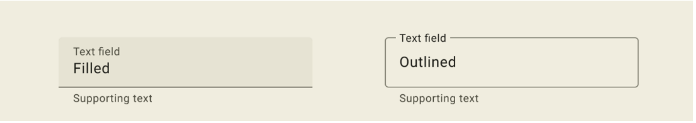

<sub>Slide 2, image 1</sub>

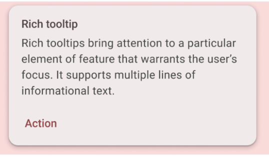

<sub>Slide 2, image 2</sub>

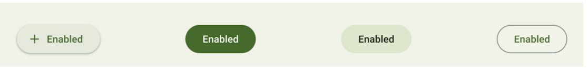

<sub>Slide 2, image 3</sub>

<sub>Source: slide 2 of the original deck.</sub>

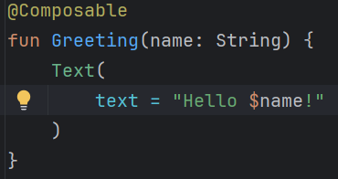

<sub>Source: slide 4 of the original deck.</sub>


---

# Happy Birthday Demo

## 2. Start with an Empty Activity

Create a new **Empty Activity** project.

**Project name:** `Happy Birthday`

In the generated preview:

1. Rename `GreetingPreview()` to `BirthdayCardPreview()`.
2. Replace `"Android"` with your name.

```kotlin
@Preview(showBackground = true)
@Composable
fun BirthdayCardPreview() {
    HappyBirthdayTheme {
        Greeting("James")
    }
}
```

### Original slide visuals

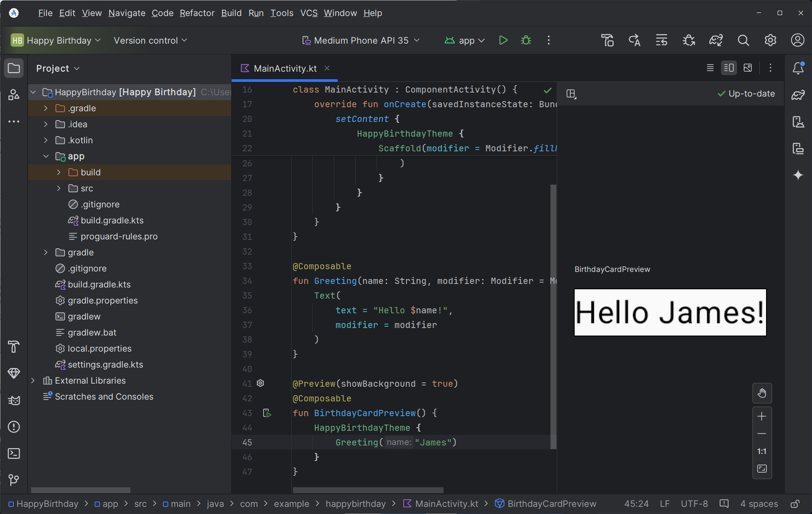

<sub>Source: slide 5 of the original deck.</sub>


---

## 3. Remove the Generated Greeting

Delete the generated `Greeting()` function.

Android Studio will now show errors anywhere `Greeting()` is still called.

Delete those calls from:

- `onCreate()`
- `BirthdayCardPreview()`

This leaves us with a clean place to build our own UI.

### Original slide visuals

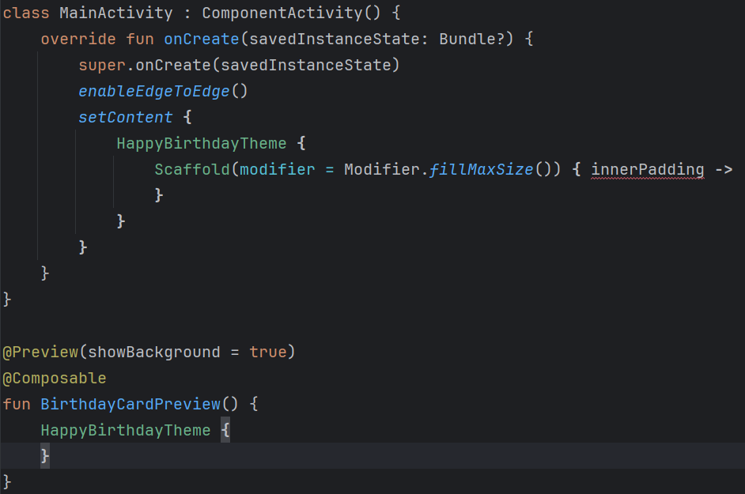

<sub>Source: slide 6 of the original deck.</sub>


---

## 4. Create `GreetingText()`

Add a new composable before the preview.

```kotlin
@Composable
fun GreetingText(
    message: String,
    modifier: Modifier = Modifier
) {
    Text(
        text = message
    )
}
```

### Why take a `Modifier`?

It is good Compose practice for a reusable composable to accept a `Modifier` and pass it to its top-level child/layout.

For now we will add the parameter, then use it once we introduce a layout container.

### Original slide visuals

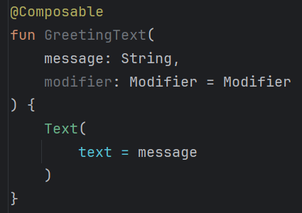

<sub>Source: slide 7 of the original deck.</sub>


---

## 5. Preview `GreetingText()`

Call the new composable from the preview.

```kotlin
@Preview(showBackground = true)
@Composable
fun BirthdayCardPreview() {
    HappyBirthdayTheme {
        GreetingText(
            message = "Happy Birthday James!"
        )
    }
}
```

The Design pane should update automatically.

### Original slide visuals

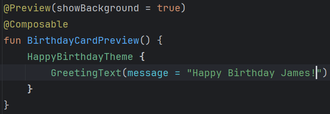

<sub>Slide 8, image 1</sub>

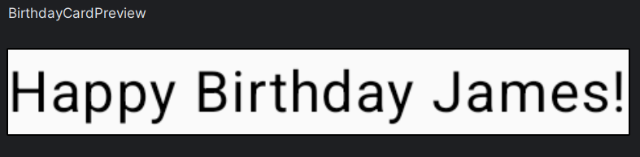

<sub>Slide 8, image 2</sub>

<sub>Source: slide 8 of the original deck.</sub>


---

## 6. Change the Font Size

Compose text sizes normally use **scalable pixels (`sp`)** so text responds to the user's preferred font size.

```kotlin
Text(
    text = message,
    fontSize = 100.sp
)
```

Import:

```kotlin
import androidx.compose.ui.unit.sp
```

### We broke it

At a very large font size, multiple lines may overlap because the default line height is no longer appropriate.

Add a line height:

```kotlin
Text(
    text = message,
    fontSize = 100.sp,
    lineHeight = 116.sp
)
```

### Original slide visuals

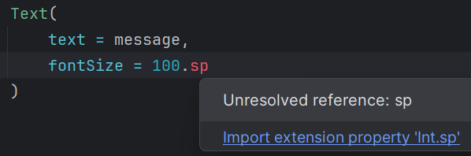

<sub>Source: slide 9 of the original deck.</sub>

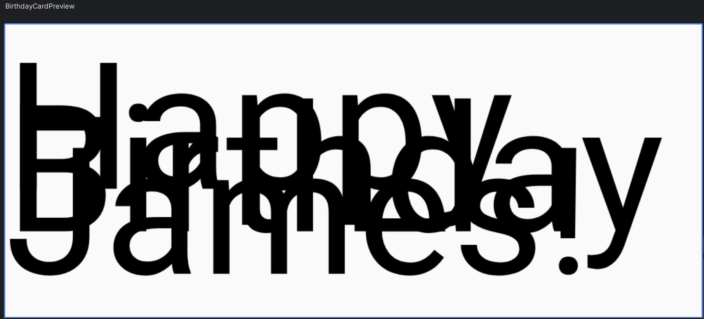

<sub>Source: slide 10 of the original deck.</sub>

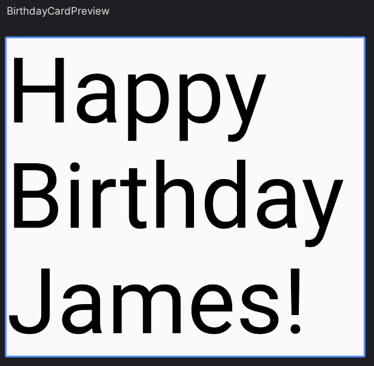

<sub>Slide 11, image 1</sub>

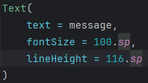

<sub>Slide 11, image 2</sub>

<sub>Source: slide 11 of the original deck.</sub>


---

## 7. Add a Second Text Element

Add another `String` parameter for the sender.

```kotlin
@Composable
fun GreetingText(
    message: String,
    from: String,
    modifier: Modifier = Modifier
) {
    Text(
        text = message,
        fontSize = 100.sp,
        lineHeight = 116.sp
    )

    Text(
        text = from,
        fontSize = 36.sp
    )
}
```

Update the preview:

```kotlin
GreetingText(
    message = "Happy Birthday James!",
    from = "From Paris"
)
```

### We broke it again

Both `Text()` composables try to occupy the same area because we have not told Compose how to arrange them.

That brings us to **layout**.

### Original slide visuals

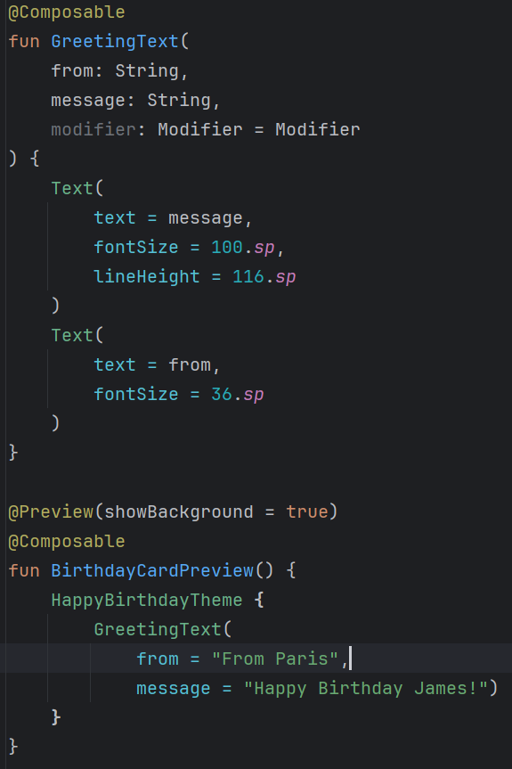

<sub>Source: slide 12 of the original deck.</sub>

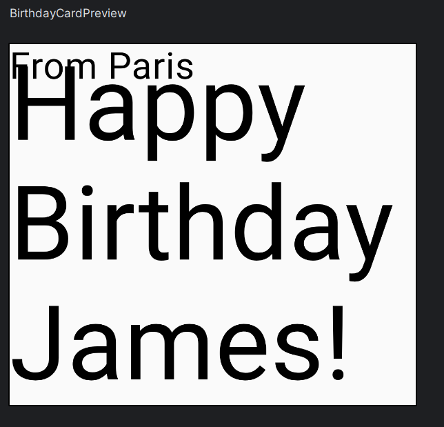

<sub>Source: slide 13 of the original deck.</sub>


---

# Layout Containers

## 8. UI Hierarchy

UI elements form a hierarchy:

```text
Parent
└── Child
    └── Child
```

A composable can contain other composables.

Three basic Compose layout containers:

- `Column` — places children vertically
- `Row` — places children horizontally
- `Box` — stacks children on top of one another

### Original slide visuals

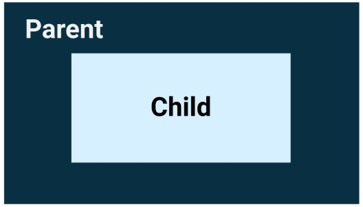

<sub>Source: slide 14 of the original deck.</sub>


---

## 9. `Row`

A `Row` lays out its children horizontally.

```kotlin
Row {
    Text("One")
    Text("Two")
    Text("Three")
}
```

Import:

```kotlin
import androidx.compose.foundation.layout.Row
```

In Android Studio, you can also select composables and use the light bulb:

**Surround with widget → Surround with Row**

This demonstrates that the trailing block is a function passed to `Row`.

### Original slide visuals

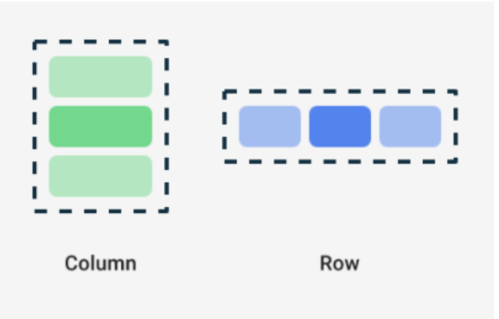

<sub>Source: slide 15 of the original deck.</sub>

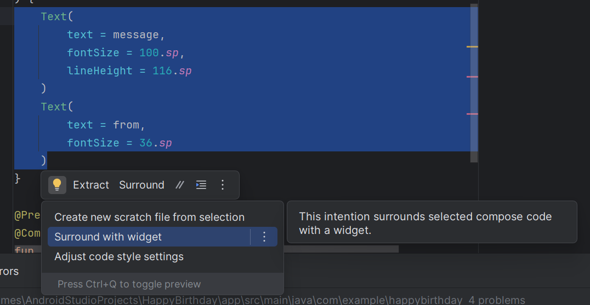

<sub>Slide 16, image 1</sub>

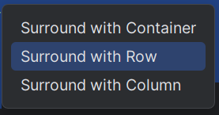

<sub>Slide 16, image 2</sub>

<sub>Source: slide 16 of the original deck.</sub>

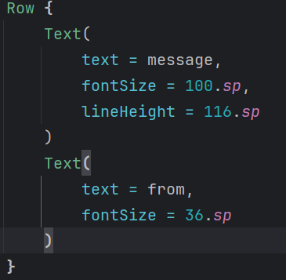

<sub>Slide 17, image 1</sub>

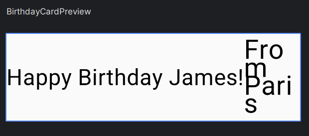

<sub>Slide 17, image 2</sub>

<sub>Source: slide 17 of the original deck.</sub>


---

## 10. Trailing Lambda Syntax

Kotlin allows the final function argument to be written outside the parentheses.

These ideas are equivalent:

```kotlin
Row(
    content = {
        Text("One")
        Text("Two")
    }
)
```

```kotlin
Row {
    Text("One")
    Text("Two")
}
```

Compose uses this syntax constantly.

### Original slide visuals

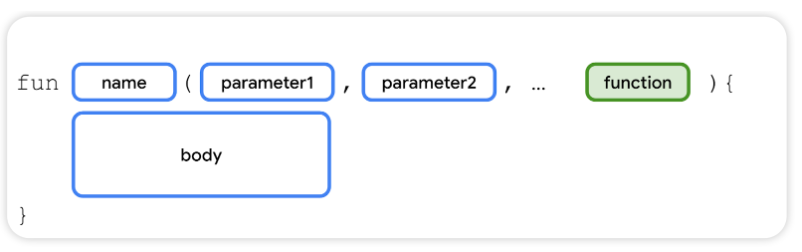

<sub>Slide 18, image 1</sub>

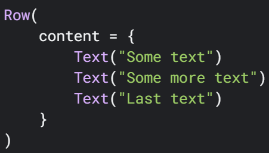

<sub>Slide 18, image 2</sub>

<sub>Source: slide 18 of the original deck.</sub>


---

## 11. Use a `Column`

A `Column` is what we actually want for the birthday message.

```kotlin
@Composable
fun GreetingText(
    message: String,
    from: String,
    modifier: Modifier = Modifier
) {
    Column(modifier = modifier) {
        Text(
            text = message,
            fontSize = 100.sp,
            lineHeight = 116.sp
        )

        Text(
            text = from,
            fontSize = 36.sp
        )
    }
}
```

Import:

```kotlin
import androidx.compose.foundation.layout.Column
```

Now the two text elements are stacked vertically instead of overlapping.

### Original slide visuals

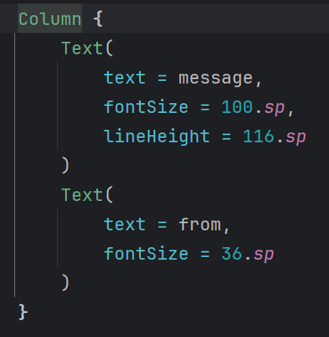

<sub>Slide 19, image 1</sub>

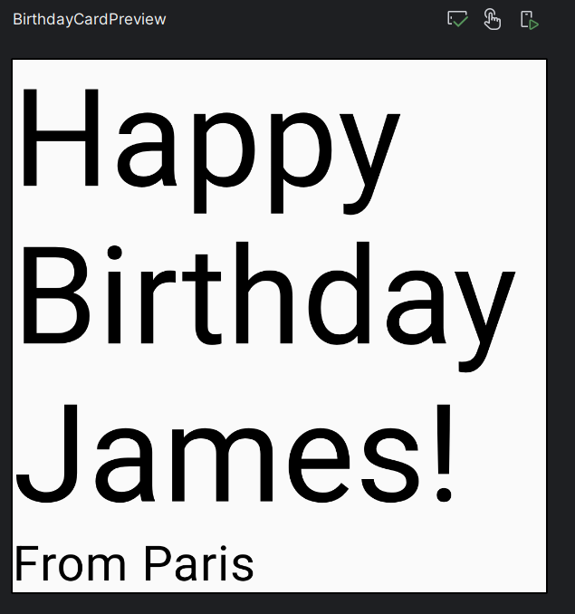

<sub>Slide 19, image 2</sub>

<sub>Source: slide 19 of the original deck.</sub>


---

# Modifiers, Arrangement, and Alignment

## 12. Pass the Modifier to the Parent Layout

The `modifier` passed into `GreetingText()` should be applied to the top-level layout:

```kotlin
Column(modifier = modifier) {
    // children
}
```

The caller can now control the outside behavior of `GreetingText()` without the composable hard-coding it.

### Original slide visuals

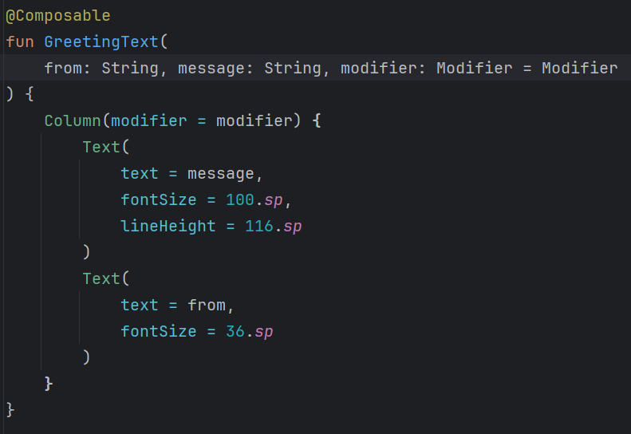

<sub>Source: slide 20 of the original deck.</sub>


---

## 13. Center the Column Vertically and Add Padding

```kotlin
Column(
    verticalArrangement = Arrangement.Center,
    modifier = modifier.padding(8.dp)
) {
    // children
}
```

Imports:

```kotlin
import androidx.compose.foundation.layout.Arrangement
import androidx.compose.foundation.layout.padding
import androidx.compose.ui.unit.dp
```

Compose layouts commonly use spacing in increments of `4.dp`.

### Original slide visuals

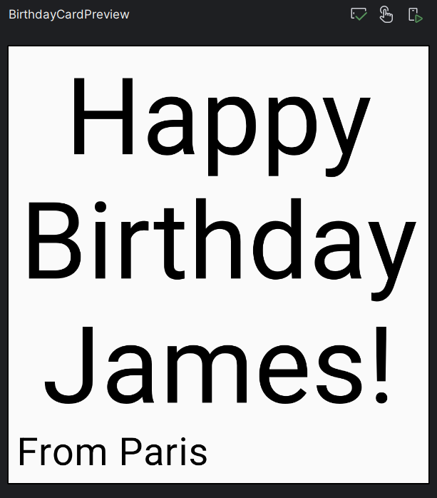

<sub>Slide 21, image 1</sub>

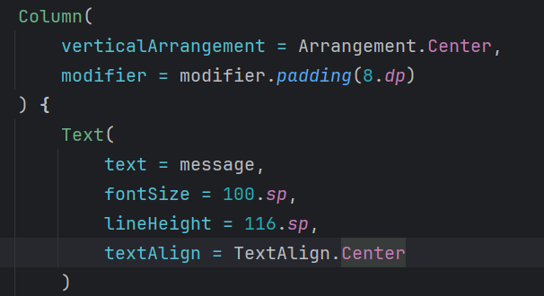

<sub>Slide 21, image 2</sub>

<sub>Source: slide 21 of the original deck.</sub>


---

## 14. Text Alignment vs. Element Alignment

To center the text *inside* a `Text` composable:

```kotlin
Text(
    text = message,
    fontSize = 100.sp,
    lineHeight = 116.sp,
    textAlign = TextAlign.Center
)
```

Import:

```kotlin
import androidx.compose.ui.text.style.TextAlign
```

`textAlign` controls the contents of the `Text` composable. It does **not** move the whole composable to the right/center of its parent.

---

## 15. Align a Child in a `Column`

Give the sender its own modifier:

```kotlin
Text(
    text = from,
    fontSize = 36.sp,
    modifier = Modifier
        .padding(16.dp)
        .align(Alignment.End)
)
```

Import:

```kotlin
import androidx.compose.ui.Alignment
```

Now the sender is aligned to the end of the `Column`.

### Original slide visuals

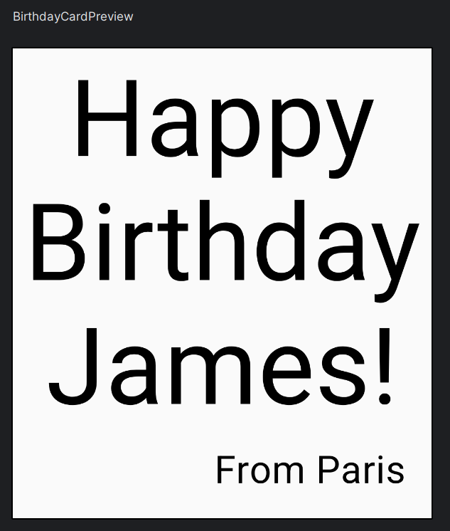

<sub>Slide 22, image 1</sub>

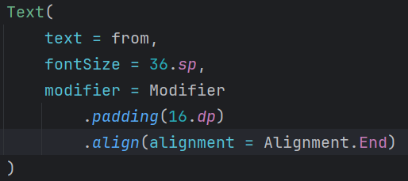

<sub>Slide 22, image 2</sub>

<sub>Source: slide 22 of the original deck.</sub>


---

## 16. Call the Composable from `onCreate()`

The actual app runs from `onCreate()`, not from the preview.

Inside the generated `Scaffold`:

```kotlin
GreetingText(
    message = "Happy Birthday Paris!",
    from = "From James",
    modifier = Modifier.padding(innerPadding)
)
```

The `innerPadding` supplied by `Scaffold` keeps content out of system UI areas.

### Original slide visuals

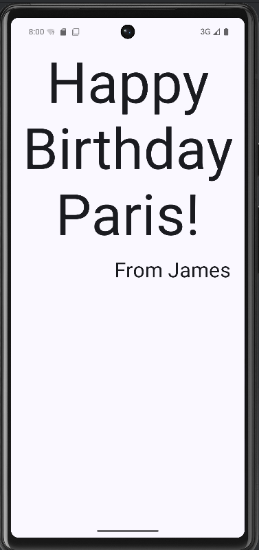

<sub>Slide 23, image 1</sub>

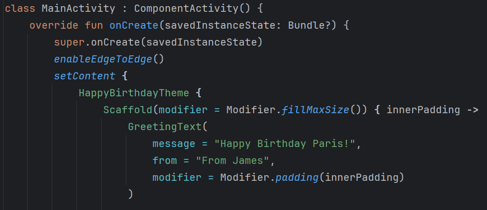

<sub>Slide 23, image 2</sub>

<sub>Source: slide 23 of the original deck.</sub>


---

# Resources

## 17. Android Resources

Resources are files/data used by the app but stored separately from Kotlin source code.

Common resource directories under `app/src/main/res/`:

```text
res/
├── drawable/       images and drawable resources
├── mipmap/         launcher icons
└── values/         strings, colors, themes, etc.
```

Benefits include reuse, localization, and keeping content separate from code.

---

## 18. Open Resource Manager

In Android Studio:

**View → Tool Windows → Resource Manager**

The Resource Manager can import, manage, and inspect app resources.

### Original slide visuals

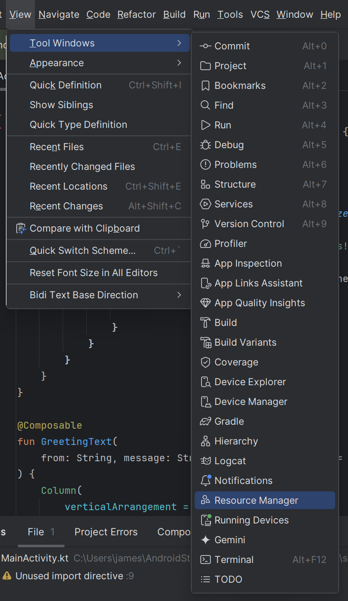

<sub>Slide 25, image 1</sub>

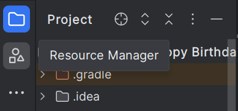

<sub>Slide 25, image 2</sub>

<sub>Source: slide 25 of the original deck.</sub>


---

## 19. Import an Image

In Resource Manager:

1. Click **+** — Add resources to the module.
2. Choose **Import Drawables**.
3. Select the image file.
4. Set **Qualifier Type** to `Density`.
5. Set the density value to **No Density**.

The imported image will appear under something like:

```text
app/src/main/res/drawable-nodpi/
```

Example filename:

```text
androidparty.png
```

### Original slide visuals

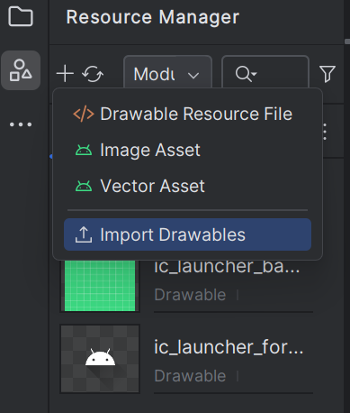

<sub>Source: slide 26 of the original deck.</sub>

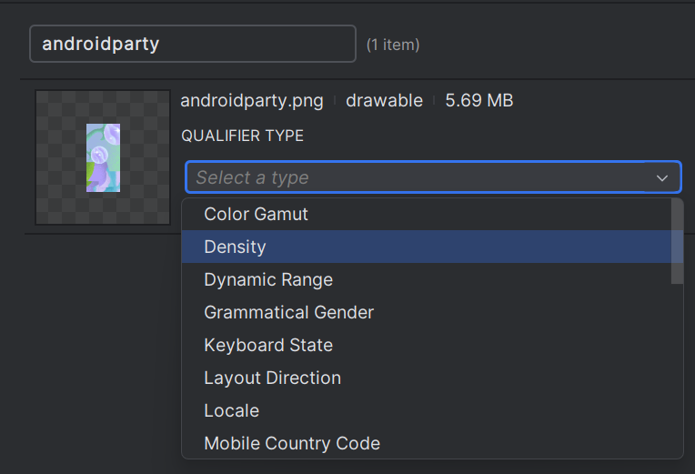

<sub>Slide 27, image 1</sub>

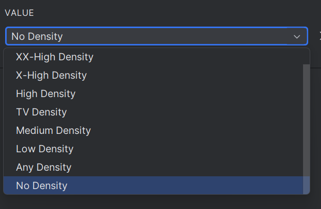

<sub>Slide 27, image 2</sub>

<sub>Source: slide 27 of the original deck.</sub>

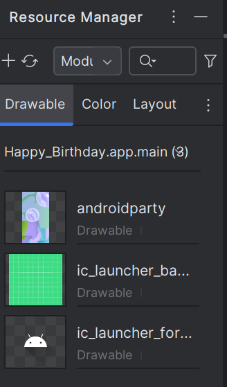

<sub>Slide 28, image 1</sub>

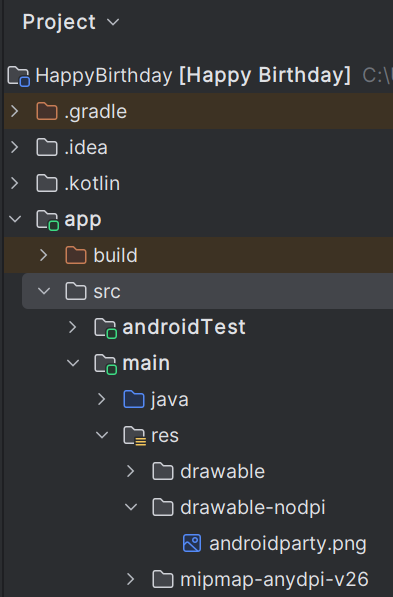

<sub>Slide 28, image 2</sub>

<sub>Source: slide 28 of the original deck.</sub>


---

## 20. Resource IDs and the `R` Class

Android generates an `R` class that gives code access to resources.

For:

```text
res/drawable-nodpi/androidparty.png
```

use:

```kotlin
R.drawable.androidparty
```

General pattern:

```text
R.<resource_type>.<resource_name>
```

### Original slide visuals

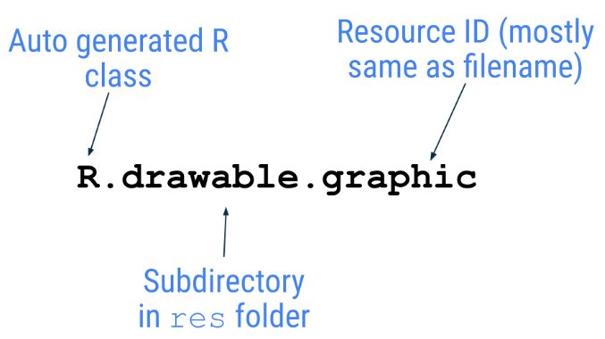

<sub>Source: slide 29 of the original deck.</sub>


---

# Images and `Box`

## 21. Create `GreetingImage()`

Load the image with `painterResource()` and display it with `Image()`.

```kotlin
@Composable
fun GreetingImage(
    message: String,
    from: String,
    modifier: Modifier = Modifier
) {
    val image = painterResource(R.drawable.androidparty)

    Image(
        painter = image,
        contentDescription = null
    )
}
```

Imports:

```kotlin
import androidx.compose.foundation.Image
import androidx.compose.ui.res.painterResource
```

### `contentDescription`

`contentDescription` is used by accessibility services such as TalkBack.

For a purely decorative image, `null` is appropriate.

### Original slide visuals

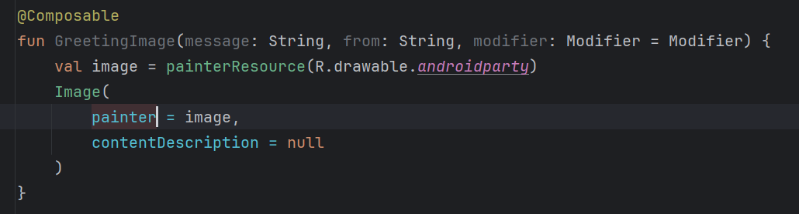

<sub>Source: slide 31 of the original deck.</sub>


---

## 22. Preview the Image

Replace `GreetingText()` with `GreetingImage()` in the preview:

```kotlin
@Preview(showBackground = true)
@Composable
fun BirthdayCardPreview() {
    HappyBirthdayTheme {
        GreetingImage(
            message = "Happy Birthday James!",
            from = "From Paris"
        )
    }
}
```

At this point only the image is displayed.

### Original slide visuals

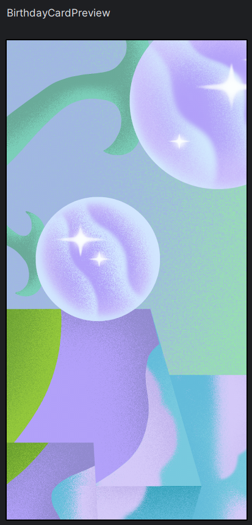

<sub>Slide 32, image 1</sub>

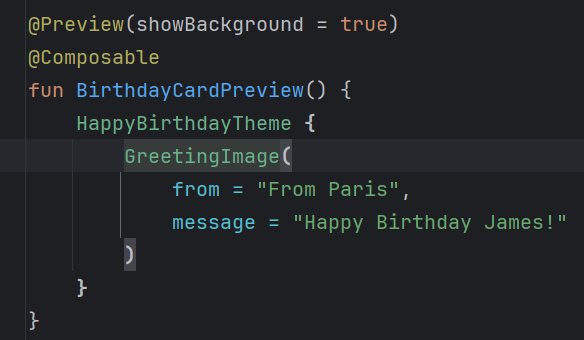

<sub>Slide 32, image 2</sub>

<sub>Source: slide 32 of the original deck.</sub>


---

## 23. `Box` Layout

A `Box` stacks children on top of one another.

That makes it useful for putting text over an image.

```kotlin
Box(modifier = modifier) {
    Image(
        painter = image,
        contentDescription = null
    )
}
```

Import:

```kotlin
import androidx.compose.foundation.layout.Box
```

### Original slide visuals

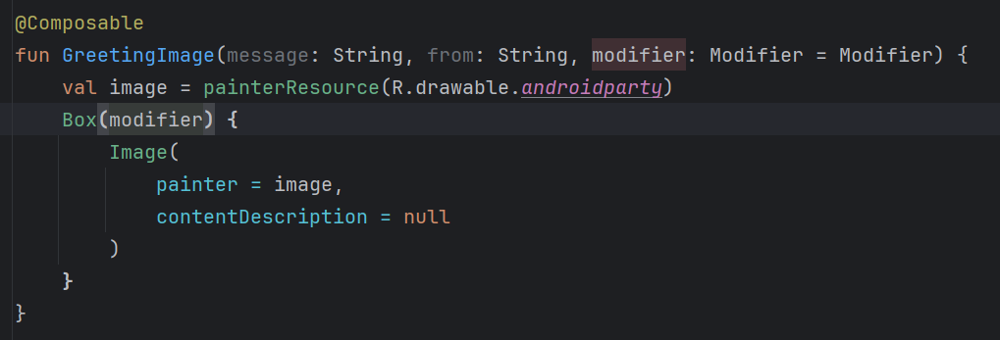

<sub>Source: slide 33 of the original deck.</sub>


---

## 24. Put the Text on Top of the Image

Add `GreetingText()` after `Image()` inside the `Box`.

```kotlin
@Composable
fun GreetingImage(
    message: String,
    from: String,
    modifier: Modifier = Modifier
) {
    val image = painterResource(R.drawable.androidparty)

    Box(modifier = modifier) {
        Image(
            painter = image,
            contentDescription = null
        )

        GreetingText(
            message = message,
            from = from,
            modifier = Modifier
                .fillMaxSize()
                .padding(8.dp)
        )
    }
}
```

Import if needed:

```kotlin
import androidx.compose.foundation.layout.fillMaxSize
```

You may need to reduce the large message font size so it fits comfortably on the image.

### Original slide visuals

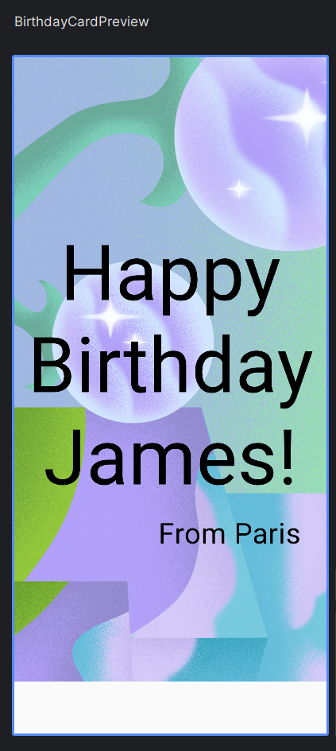

<sub>Slide 34, image 1</sub>

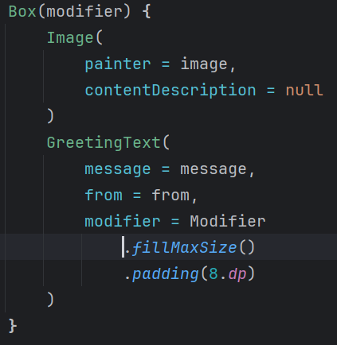

<sub>Slide 34, image 2</sub>

<sub>Source: slide 34 of the original deck.</sub>


---

## 25. Run the Image Version on the Emulator

Change the call inside `onCreate()` from `GreetingText()` to `GreetingImage()`:

```kotlin
GreetingImage(
    message = "Happy Birthday Paris!",
    from = "From James",
    modifier = Modifier.padding(innerPadding)
)
```

Run the app on the emulator/device.

### Original slide visuals

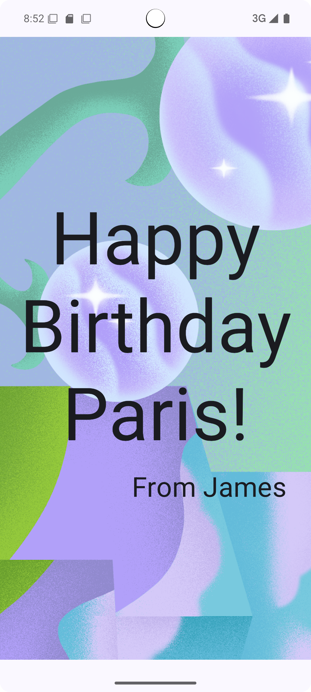

<sub>Slide 35, image 1</sub>

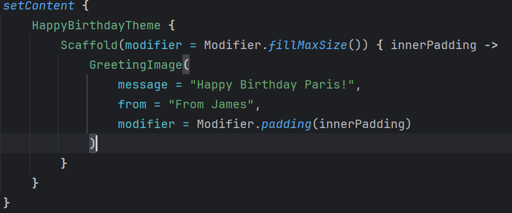

<sub>Slide 35, image 2</sub>

<sub>Source: slide 35 of the original deck.</sub>


---

## 26. Scale the Image

`contentScale` controls how an image is resized inside its available space.

```kotlin
Image(
    painter = image,
    contentDescription = null,
    contentScale = ContentScale.Crop
)
```

Import:

```kotlin
import androidx.compose.ui.layout.ContentScale
```

`ContentScale.Crop`:

- preserves aspect ratio
- scales uniformly
- crops excess content when necessary to fill the available area

### Original slide visuals

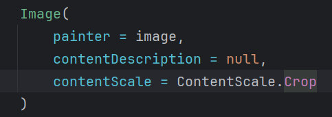

<sub>Source: slide 36 of the original deck.</sub>

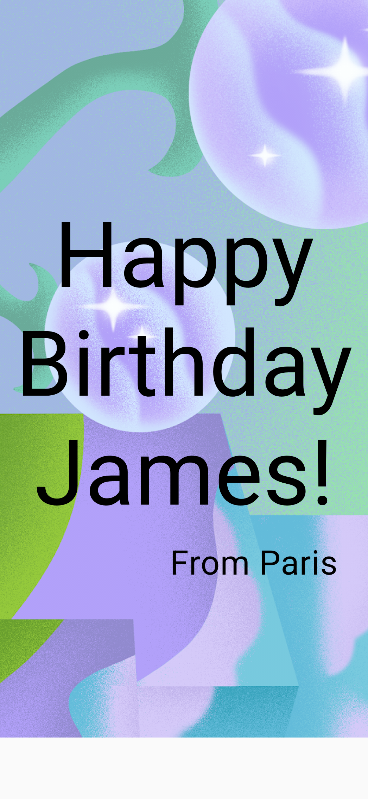

<sub>Slide 37, image 1</sub>

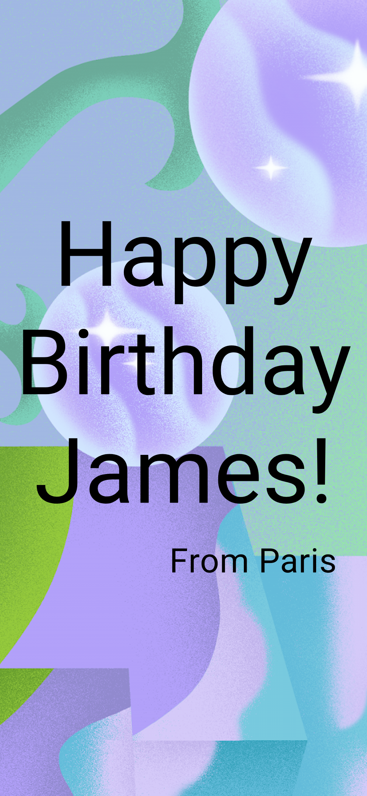

<sub>Slide 37, image 2</sub>

<sub>Source: slide 37 of the original deck.</sub>


---

## 27. Image Opacity

The `alpha` parameter controls transparency.

```kotlin
Image(
    painter = image,
    contentDescription = null,
    contentScale = ContentScale.Crop,
    alpha = 0.5f
)
```

- `1.0f` = fully opaque
- `0.0f` = fully transparent

Reducing image opacity can make overlaid text easier to read.

### Original slide visuals

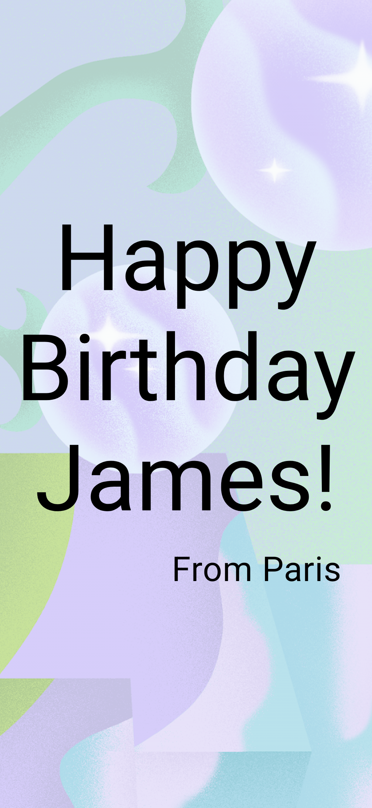

<sub>Slide 38, image 1</sub>

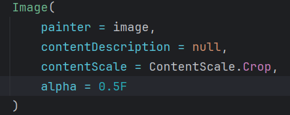

<sub>Slide 38, image 2</sub>

<sub>Source: slide 38 of the original deck.</sub>


---

# Layout Modifier Reference

## 28. Arrangement

### `Column` — `verticalArrangement`

```kotlin
Column(
    verticalArrangement = Arrangement.SpaceBetween
) {
    // children
}
```

Useful options:

```text
Arrangement.Top
Arrangement.Center
Arrangement.Bottom
Arrangement.SpaceBetween
Arrangement.SpaceAround
Arrangement.SpaceEvenly
```

### `Row` — `horizontalArrangement`

```kotlin
Row(
    horizontalArrangement = Arrangement.SpaceEvenly
) {
    // children
}
```

Useful options:

```text
Arrangement.Start
Arrangement.Center
Arrangement.End
Arrangement.SpaceBetween
Arrangement.SpaceAround
Arrangement.SpaceEvenly
```

### Equal-width / equal-height children

Weight is separate from arrangement:

```kotlin
Modifier.weight(1f)
```

### Original slide visuals

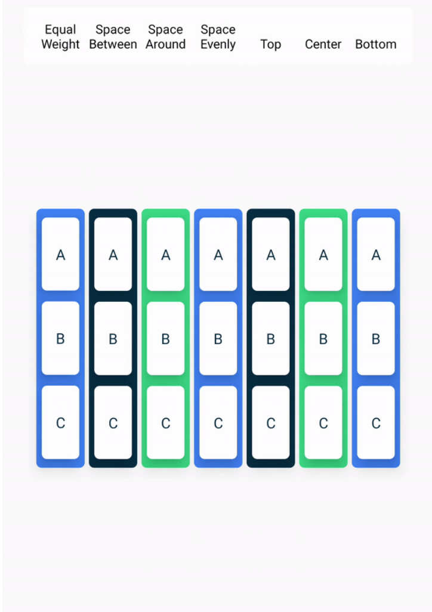

<sub>Slide 40, image 1</sub>

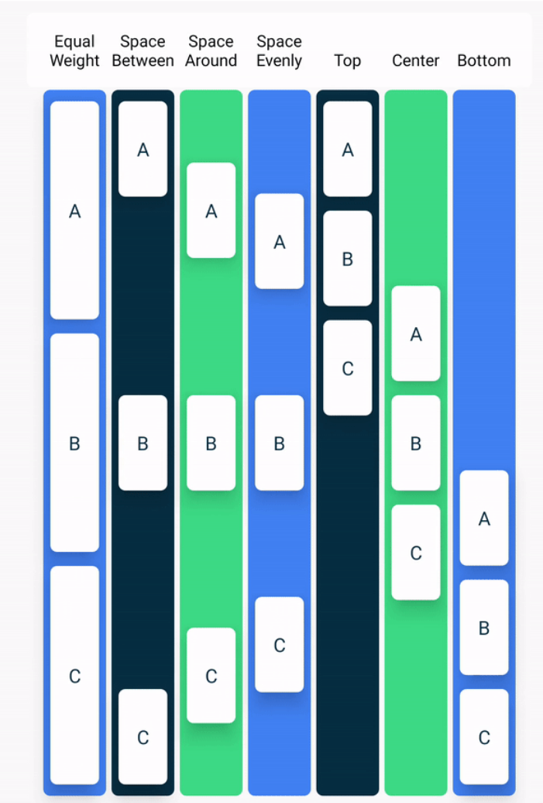

<sub>Slide 40, image 2</sub>

<sub>Source: slide 40 of the original deck.</sub>

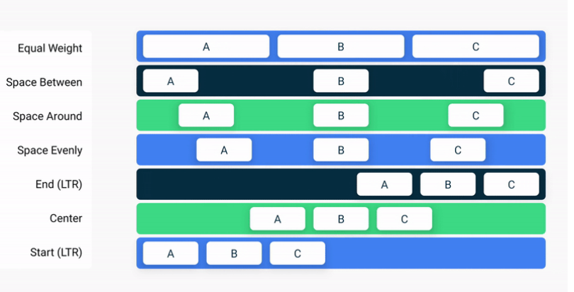

<sub>Source: slide 41 of the original deck.</sub>


---

## 29. Padding

Padding adds space around a composable's content.

Same amount on all sides:

```kotlin
Modifier.padding(16.dp)
```

Different values:

```kotlin
Modifier.padding(
    start = 8.dp,
    top = 16.dp,
    end = 8.dp,
    bottom = 16.dp
)
```

### Original slide visuals

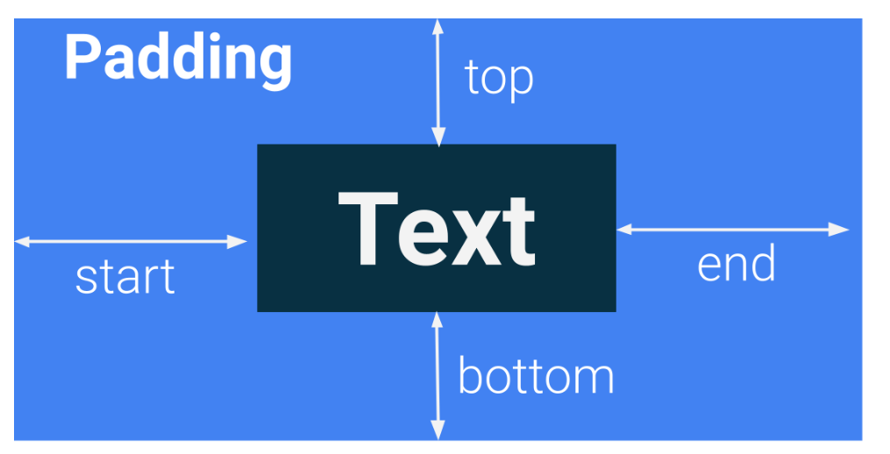

<sub>Source: slide 42 of the original deck.</sub>


---

# String Resources

## 30. Avoid Hardcoded UI Strings

A hardcoded string is written directly into Kotlin:

```kotlin
message = "Happy Birthday Paris!"
```

Android Studio can extract it into a string resource:

1. Put the cursor on the string.
2. Use the light bulb / intention menu.
3. Choose **Extract string resource**.

The Kotlin becomes:

```kotlin
message = stringResource(R.string.happy_birthday_paris)
```

Import:

```kotlin
import androidx.compose.ui.res.stringResource
```

### Original slide visuals

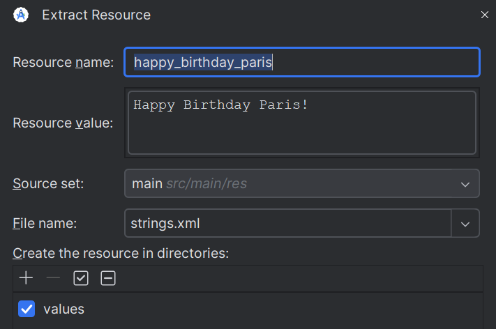

<sub>Slide 43, image 1</sub>

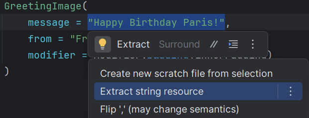

<sub>Slide 43, image 2</sub>

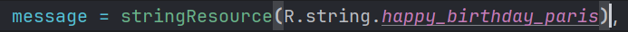

<sub>Slide 43, image 3</sub>

<sub>Source: slide 43 of the original deck.</sub>


---

## 31. `strings.xml`

Location:

```text
app/src/main/res/values/strings.xml
```

Example:

```xml
<resources>
    <string name="app_name">Happy Birthday</string>
    <string name="happy_birthday_paris">Happy Birthday Paris!</string>
</resources>
```

The app name is also stored here.

### Original slide visuals

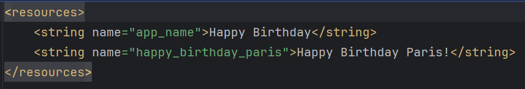

<sub>Source: slide 44 of the original deck.</sub>


---

# Complete Demo Version

A compact version of the code at the end of the demo might look like this:

```kotlin
@Composable
fun GreetingText(
    message: String,
    from: String,
    modifier: Modifier = Modifier
) {
    Column(
        verticalArrangement = Arrangement.Center,
        modifier = modifier.padding(8.dp)
    ) {
        Text(
            text = message,
            fontSize = 72.sp,
            lineHeight = 84.sp,
            textAlign = TextAlign.Center
        )

        Text(
            text = from,
            fontSize = 36.sp,
            modifier = Modifier
                .padding(16.dp)
                .align(Alignment.End)
        )
    }
}

@Composable
fun GreetingImage(
    message: String,
    from: String,
    modifier: Modifier = Modifier
) {
    val image = painterResource(R.drawable.androidparty)

    Box(modifier = modifier) {
        Image(
            painter = image,
            contentDescription = null,
            contentScale = ContentScale.Crop,
            alpha = 0.5f,
            modifier = Modifier.fillMaxSize()
        )

        GreetingText(
            message = message,
            from = from,
            modifier = Modifier.fillMaxSize()
        )
    }
}
```

And from the `Scaffold` in `onCreate()`:

```kotlin
GreetingImage(
    message = stringResource(R.string.happy_birthday_paris),
    from = "From James",
    modifier = Modifier
        .fillMaxSize()
        .padding(innerPadding)
)
```

---

---

## Closing Image from the Original Deck


<sub>Source: slide 45 of the original deck.</sub>


## Main Ideas to Leave With

- Composable functions describe UI.
- `Row`, `Column`, and `Box` determine how children are laid out.
- `Modifier` changes size, spacing, alignment, and other behavior.
- Arrangement controls how multiple children use available space.
- Resources keep images and strings separate from source code.
- `Box` is useful when elements need to overlap, such as text over an image.
